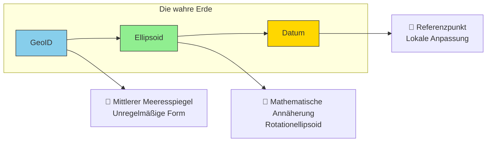
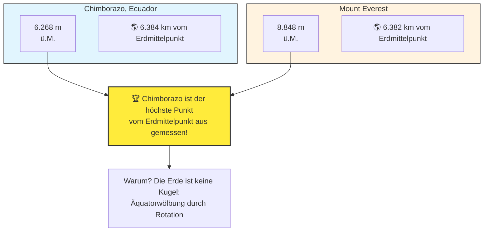
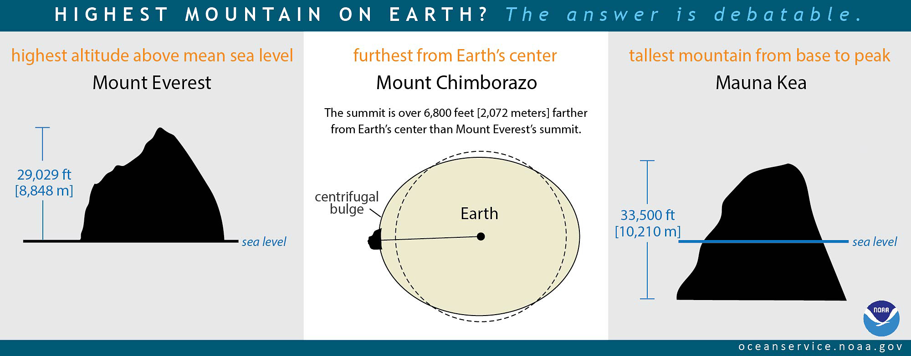
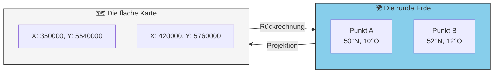
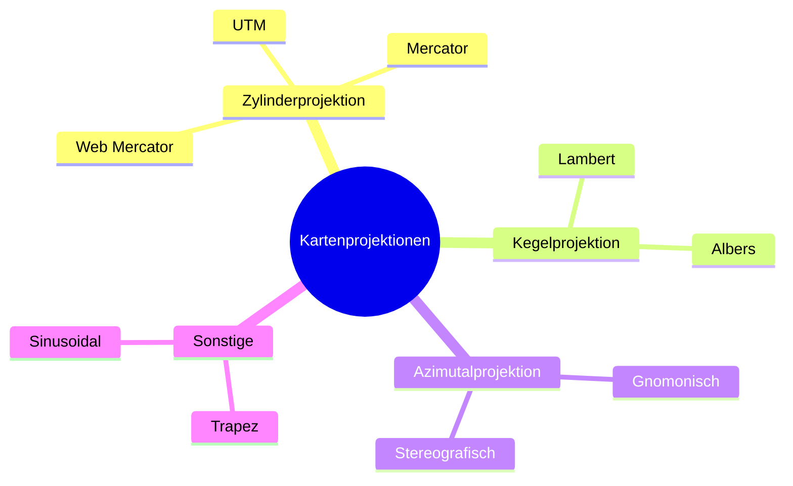
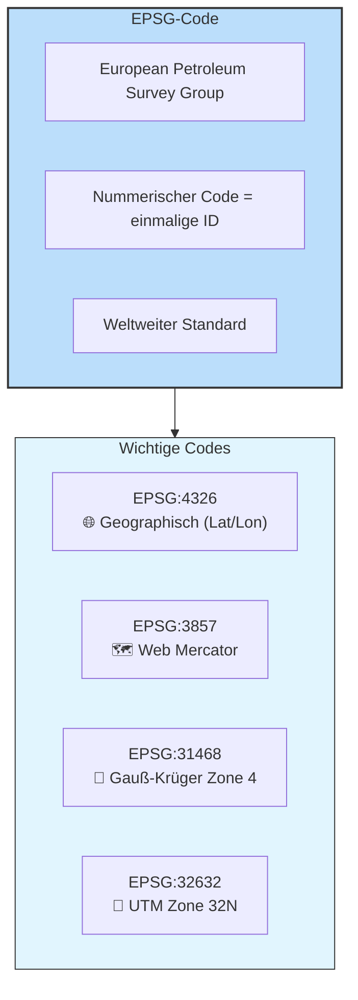
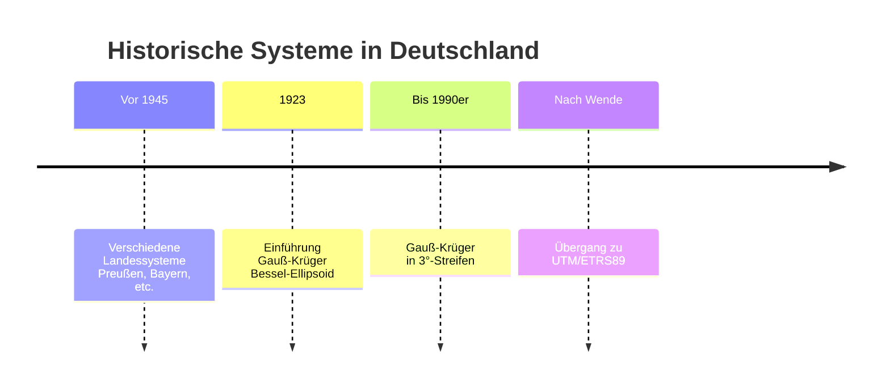
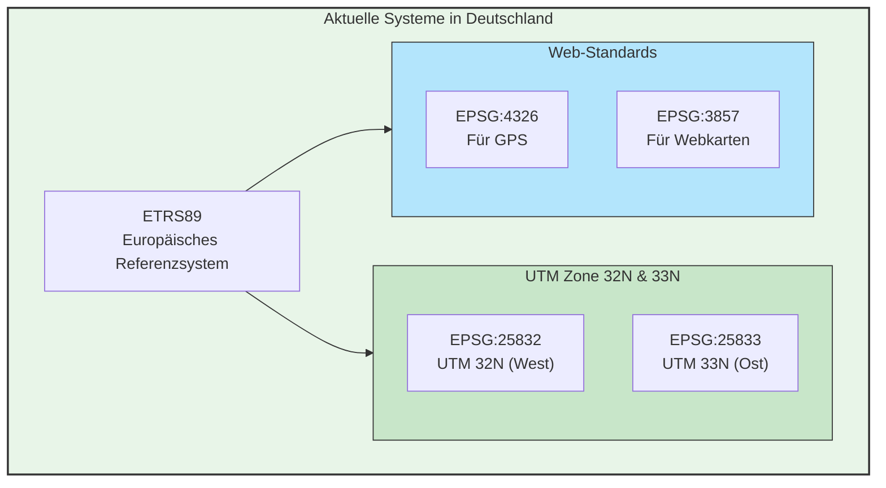
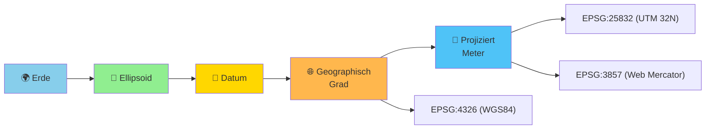

# Koordinatenreferenzsysteme

---

## Grundlagen: Vom GeoID zum Datum

| Begriff | Beschreibung | Beispiel |
|---------|--------------|----------|
| **GeoID** | Äquipotentialfläche des Schwerefelds (mittlerer Meeresspiegel) | Unregelmäßige "Kartoffelform" |
| **Ellipsoid** | Mathematisch definierte Annäherung an das GeoID | Rotationsellipsoid |
| **Datum** | Festlegung des Ellipsoids relativ zur Erde | WGS84, ETRS89 |

---

🧠 <strong>Trivia: Der höchste Berg der Erde? (Zum Aufklappen)</strong>

 
Chimborazo vs. Everest – Wer ist wirklich höher?

Überraschung: Der Chimborazo in Ecuador ist zwar niedriger über dem Meeresspiegel (6.268m vs. 8.848m), aber weil die Erde am Äquator durch die Rotation "dicker" ist, ragt sein Gipfel weiter ins Weltall – er ist der Punkt der Erde, der am weitesten vom Erdmittelpunkt entfernt liegt!

 

{ width="600" }
[Datenquelle](https://oceanservice.noaa.gov/facts/highestpoint.html#:~:text=Earth%20is%20not%20a%20perfect,center%20than%20Mount%20Everest's%20summit.)

---

## Geographische vs. Projizierte Koordinatensysteme

| Merkmal | 🌐 Geographisch | 📏 Projiziert |
|---------|-----------------|---------------|
| **Einheit** | Grad (°) | Meter (m) |
| **Oberfläche** | Kugel/Ellipsoid | Ebene (Karte) |
| **Verzerrung** | Winkel treu (flächenverzerrt) | Fläche treu (winkelverzerrt) |
| **Beispiel** | WGS84 (Lat/Lon) | UTM, Gauss-Krüger |
| **Einsatz** | GPS, globale Daten | Kataster, Navigation vor Ort |

---

## Kartenprojektionen

Die wichtigsten Projektionen im Überblick

| Projektion | Typ | Eigenschaft | Einsatz |
|------------|-----|-------------|---------|
| **Mercator** | Zylinder | Winkeltreu | Seefahrt (historisch) |
| **Web Mercator (EPSG:3857)** | Zylinder | Winkeltreu | Google Maps, OpenStreetMap |
| **UTM (EPSG:32633-etc.)** | Zylinder | Winkeltreu, streifenförmig | Topografische Karten weltweit |
| **Gauß-Krüger (EPSG:31466-31469)** | Zylinder | Winkeltreu | Historisches DE-System (3°-Streifen) |

---

## Was ist ein EPSG-Code?

> **EPSG-Codes** sind eindeutige Nummern für Koordinatenreferenzsysteme.  
> Z.B. bedeutet **EPSG:4326** = WGS84 (geographisch, Grad)  
> **EPSG:3857** = Web Mercator (für Google Maps, OSM)

---

## Koordinatensysteme in Deutschland

**Früher (historisch)**

| System | EPSG | Ellipsoid | Streifen | Einsatz |
|--------|------|-----------|----------|---------|
| **Gauß-Krüger Zone 2** | EPSG:31466 | Bessel 1841 | 6° (historisch) | Westdeutschland |
| **Gauß-Krüger Zone 3** | EPSG:31467 | Bessel 1841 | 9° | West-/Mitteldeutschland |
| **Gauß-Krüger Zone 4** | EPSG:31468 | Bessel 1841 | 12° | Ostdeutschland |
| **Gauß-Krüger Zone 5** | EPSG:31469 | Bessel 1841 | 15° | Sachsen |

**Heute (aktuell)**

| System | EPSG | Beschreibung | Verwendung |
|--------|------|--------------|------------|
| **ETRS89 / UTM 32N** | **EPSG:25832** | Offizielles System Westdeutschland | Behörden, Kataster (westl. BRD) |
| **ETRS89 / UTM 33N** | **EPSG:25833** | Offizielles System Ostdeutschland | Behörden, Kataster (östl. BRD) |
| **WGS 84** | **EPSG:4326** | Globales geographisches System | GPS, Smartphones |
| **Web Mercator** | **EPSG:3857** | Für Webkarten optimiert | Google Maps, OSM |

---

## Zusammenfassung

