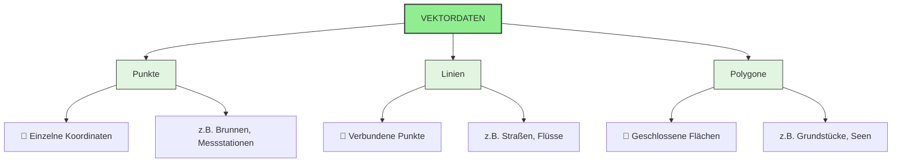
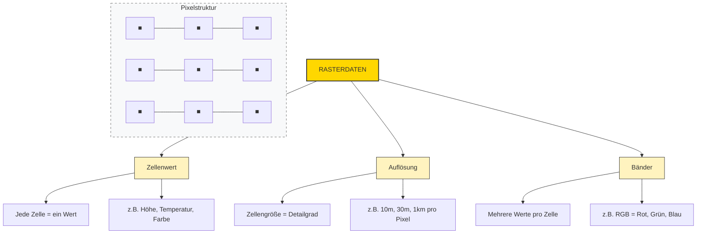
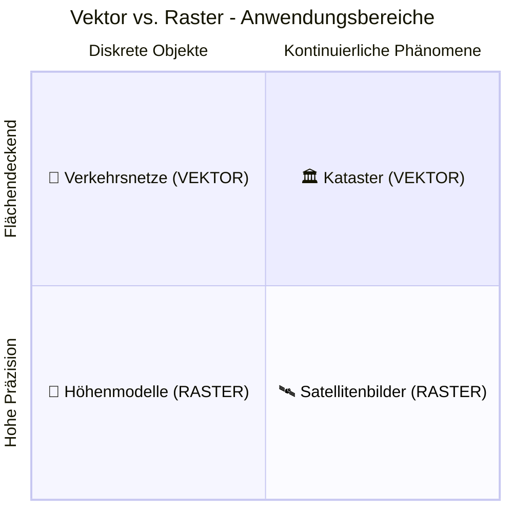
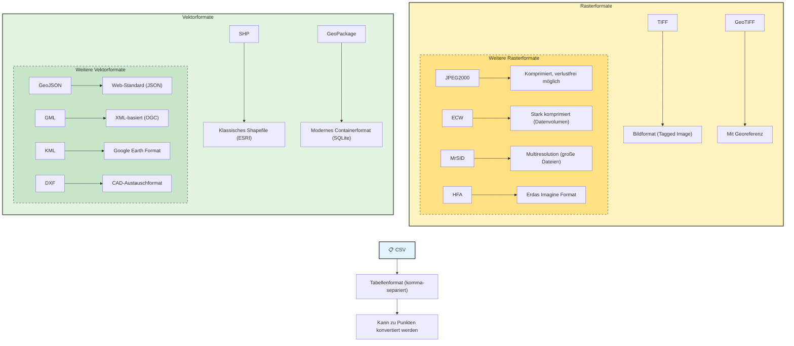

# Datentypen – Raster vs. Vektor

## Vektordaten

Eigenschaften:

**Klare Grenzen** – Objekte sind exakt definiert  
**Attributtabelle** – Jedes Objekt hat Sachdaten  
**Präzise Geometrie** – Hohe Genauigkeit  
**Geringe Dateigröße** – Speichereffizient

---

## Rasterdaten

Eigenschaften:

**Kontinuierliche Daten** – Nahtlose Übergänge  
**Ideal für** – Luftbilder, Satellitenaufnahmen, Höhenmodelle  
**Einfache Struktur** – Matrix aus Zellen  
**Algebra möglich** – Rasterberechnungen (z.B. NDVI)

---
## Vektor vs. Raster

{ width="500" }

---

## Typische Formate

