# Datentypen – Raster vs. Vektor

## Vektordaten

```mermaid
graph TD
    V[VEKTORDATEN] --> P[Punkte]
    V --> L[Linien]
    V --> POL[Polygone]
    
    P --> P1["📍 Einzelne Koordinaten"]
    P --> P2["z.B. Brunnen, Messstationen"]
    
    L --> L1["📏 Verbundene Punkte"]
    L --> L2["z.B. Straßen, Flüsse"]
    
    POL --> POL1["🔲 Geschlossene Flächen"]
    POL --> POL2["z.B. Grundstücke, Seen"]
    
    style V fill:#90EE90,stroke:#333,stroke-width:2px
    style P fill:#e1f5e1,stroke:#333
    style L fill:#e1f5e1,stroke:#333
    style POL fill:#e1f5e1,stroke:#333
```

Eigenschaften:

**Klare Grenzen** – Objekte sind exakt definiert  
**Attributtabelle** – Jedes Objekt hat Sachdaten  
**Präzise Geometrie** – Hohe Genauigkeit  
**Geringe Dateigröße** – Speichereffizient

---

## Rasterdaten

```mermaid
graph TD
    R[RASTERDATEN] --> Z[Zellenwert]
    R --> A[Auflösung]
    R --> B[Bänder]
    
    Z --> Z1["Jede Zelle = ein Wert"]
    Z --> Z2["z.B. Höhe, Temperatur, Farbe"]
    
    A --> A1["Zellengröße = Detailgrad"]
    A --> A2["z.B. 10m, 30m, 1km pro Pixel"]
    
    B --> B1["Mehrere Werte pro Zelle"]
    B --> B2["z.B. RGB = Rot, Grün, Blau"]
       
    subgraph Pixelstruktur
        P1[■] --- P2[■] --- P3[■]
        P4[■] --- P5[■] --- P6[■]
        P7[■] --- P8[■] --- P9[■]
    end
    
    style R fill:#FFD700,stroke:#333,stroke-width:2px
    style Z fill:#fff3bf,stroke:#333
    style A fill:#fff3bf,stroke:#333
    style B fill:#fff3bf,stroke:#333
    style Pixelstruktur fill:#f8f9fa,stroke:#666,stroke-dasharray: 5 5
```

Eigenschaften:

**Kontinuierliche Daten** – Nahtlose Übergänge  
**Ideal für** – Luftbilder, Satellitenaufnahmen, Höhenmodelle  
**Einfache Struktur** – Matrix aus Zellen  
**Algebra möglich** – Rasterberechnungen (z.B. NDVI)

---
## Vektor vs. Raster

```mermaid
quadrantChart
    title Vektor vs. Raster - Anwendungsbereiche
    x-axis "Diskrete Objekte" --> "Kontinuierliche Phänomene"
    y-axis "Hohe Präzision" --> "Flächendeckend"
    quadrant-1 "🏛️ Kataster (VEKTOR)"
    quadrant-2 "🚦 Verkehrsnetze (VEKTOR)"
    quadrant-3 "🌲 Höhenmodelle (RASTER)"
    quadrant-4 "🛰️ Satellitenbilder (RASTER)"
```

{ width="500" }

---

## Typische Formate

