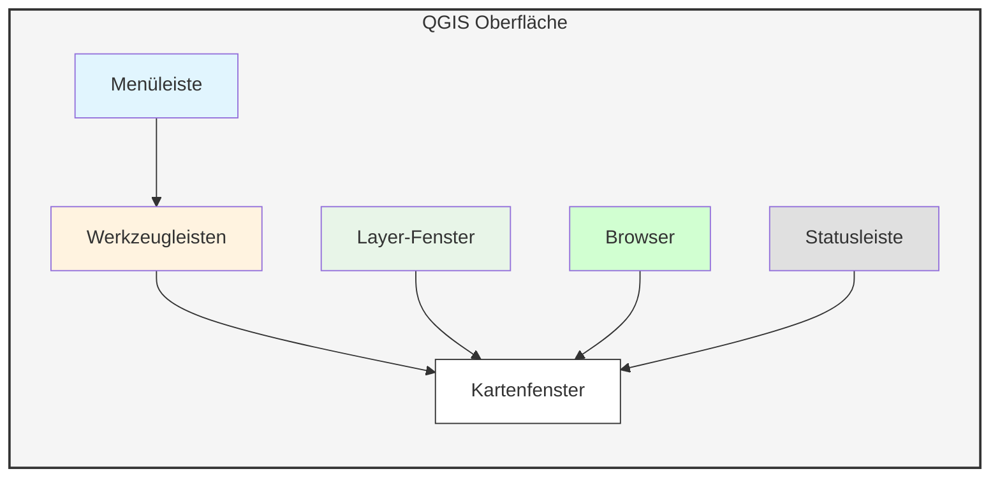
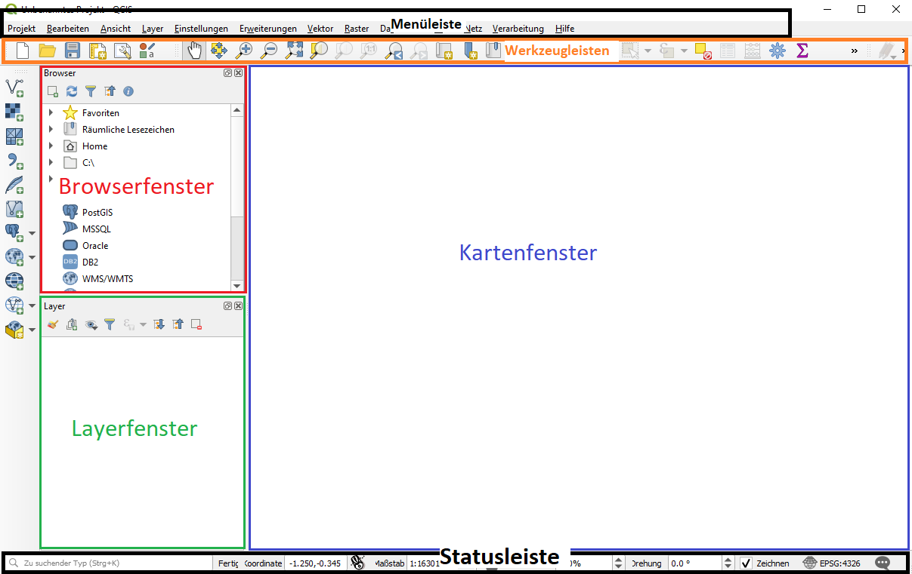
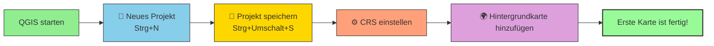
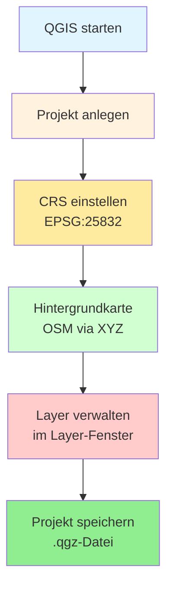

# QGIS – Oberfläche & erste Schritte

*QGIS-Oberfläche: { width="600" }*

------------------------------------------------------------------------

### Die wichtigsten Bereiche im Detail

| Bereich                    | Funktion                         | Tipp                             |
|----------------------------|----------------------------------|----------------------------------|
| **Layer-Fenster** (links)  | Verwaltung aller geladenen Layer | Reihenfolge = Zeichenreihenfolge |
| **Browser** (links unten)  | Datenquellen durchsuchen         | Drag & Drop möglich              |
| **Kartenfenster** (Mitte)  | Hauptarbeitsbereich              | Navigation mit Mausrad           |
| **Werkzeugleisten** (oben) | Schnellzugriff auf Werkzeuge     | Rechtsklick → ein-/ausblenden    |
| **Statusleiste** (unten)   | CRS, Koordinaten, Maßstab        | Hier CRS schnell ändern          |

------------------------------------------------------------------------

## Erste Schritte: Projekt anlegen

------------------------------------------------------------------------

## Zusammenfassung

