# QGIS – Oberfläche & erste Schritte

*QGIS-Oberfläche: { width="600" }*

------------------------------------------------------------------------

### Die wichtigsten Bereiche im Detail

| Bereich                    | Funktion                         | Tipp                             |
|----------------------------|----------------------------------|----------------------------------|
| **Layer-Fenster** (links)  | Verwaltung aller geladenen Layer | Reihenfolge = Zeichenreihenfolge |
| **Browser** (links unten)  | Datenquellen durchsuchen         | Drag & Drop möglich              |
| **Kartenfenster** (Mitte)  | Hauptarbeitsbereich              | Navigation mit Mausrad           |
| **Werkzeugleisten** (oben) | Schnellzugriff auf Werkzeuge     | Rechtsklick → ein-/ausblenden    |
| **Statusleiste** (unten)   | CRS, Koordinaten, Maßstab        | Hier CRS schnell ändern          |

------------------------------------------------------------------------

## Erste Schritte: Projekt anlegen

``` mermaid
flowchart LR
    A["QGIS starten"] --> B["📁 Neues Projekt<br/>Strg+N"]
    B --> C["💾 Projekt speichern<br/>Strg+Umschalt+S"]
    C --> D["⚙️ CRS einstellen"]
    D --> E["🌍 Hintergrundkarte hinzufügen"]
    E --> F["Erste Karte ist fertig!"]

    style A fill:#90EE90,stroke:#333
    style B fill:#87CEEB,stroke:#333
    style C fill:#FFD700,stroke:#333
    style D fill:#FFA07A,stroke:#333
    style E fill:#DDA0DD,stroke:#333
    style F fill:#98FB98,stroke:#333,stroke-width:2px
```

------------------------------------------------------------------------

## Zusammenfassung

