# Selbstlern-Teil

------------------------------------------------------------------------

## Übersicht der Themen

``` mermaid
%%{init: {'theme': 'forest'}}%%
mindmap
  root((GIS<br/>Selbstlern-Teil))
    🗺️ Was ist GIS?
      Definition
      Räumliche Fragestellungen
      Anwendungsbereiche
      Bestandteile
    📊 Datentypen
      Vektordaten
      Rasterdaten
      Vektor vs. Raster
      Formate
    🌍 Koordinatensysteme
      GeoID/Ellipsoid/Datum
      Geographisch vs. Projiziert
      Projektionen
      EPSG-Codes
      Systeme in Deutschland
    🖥️ QGIS
      Oberfläche
      Projekt anlegen
      CRS einstellen
      OSM hinzufügen
```



------------------------------------------------------------------------

## Fragenkatalog

------------------------------------------------------------------------

## Frage 1

Was ist die korrekte Definition eines Geographischen Informationssystems
(GIS)?

1)  Ein Programm zum Zeichnen von Landkarten  
2)  Ein System zur Erfassung, Speicherung, Analyse und Visualisierung
    räumlicher Daten  
3)  Eine Datenbank für Adressen  
4)  Ein CAD-Programm für Architekten

??? info "Lösung anzeigen"
    **Richtige Antwort: b)**  
    Ein GIS dient der Erfassung, Speicherung, Analyse und Visualisierungräumlicher Daten.

------------------------------------------------------------------------

## Frage 2

Welche räumliche Fragestellung kann ein GIS NICHT beantworten?

1)  Wo befinden sich alle Schulen in Berlin?  
2)  Welche Supermärkte liegen im Umkreis von 1 km?  
3)  Wie heißt der Bürgermeister von München?  
4)  Welche Flächen sind bei Hochwasser betroffen?

??? info "Lösung anzeigen"
    **Richtige Antwort: c)**  
    GIS beantwortet raumbezogene Fragen – der Name eines Bürgermeisters ist
    keine räumliche Information.

------------------------------------------------------------------------

## Frage 3

Welcher Bereich ist KEIN typischer Anwendungsbereich von GIS?

1)  Stadtplanung  
2)  Umweltanalyse  
3)  Textverarbeitung  
4)  Verkehrsplanung

??? info "Lösung anzeigen"
    **Richtige Antwort: c)**  
    Textverarbeitung ist kein GIS-Anwendungsbereich.

------------------------------------------------------------------------

## Frage 4

Was sind die drei Hauptkomponenten eines GIS?

1)  Computer, Drucker, Scanner  
2)  Fernerkundung, CAD, Datenbanken  
3)  Excel, Word, PowerPoint  
4)  Karten, Bilder, Tabellen

??? info "Lösung anzeigen"
    **Richtige Antwort: b)**

    ```mermaid
    graph TD
        F["Fernerkundung"] --> G["GIS"]
        C["CAD"] --> G
        D["Datenbanken"] --> G

        style F fill:#e1f5fe
        style C fill:#fff3e0
        style D fill:#e8f5e8
        style G fill:#90EE90,stroke-width:2px
    ```

------------------------------------------------------------------------

## Frage 5

Welche Geometrietypen gibt es bei Vektordaten?

1)  Punkte, Linien, Pixel  
2)  Punkte, Linien, Polygone  
3)  Zellen, Bänder, Pixel  
4)  Rot, Grün, Blau

??? info "Lösung anzeigen"
    **Richtige Antwort: b)**

------------------------------------------------------------------------

## Frage 6

Was ist die Grundeinheit von Rasterdaten?

1)  Punkt  
2)  Linie  
3)  Polygon  
4)  Pixel

??? info "Lösung anzeigen"
    **Richtige Antwort: d)**

------------------------------------------------------------------------

## Frage 7

Welches Format ist ein Vektorformat?

1)  TIFF  
2)  GeoTIFF  
3)  Shapefile (SHP)  
4)  JPEG

??? info "Lösung anzeigen"
    **Richtige Antwort: c)**

------------------------------------------------------------------------

## Frage 8

Welcher Unterschied ist richtig?

1)  Vektor = kontinuierlich, Raster = diskret  
2)  Vektor = präzise Objekte, Raster = kontinuierliche Flächen  
3)  Vektor = Pixel, Raster = Punkte  
4)  Vektor = für Bilder, Raster = für Grenzen

??? info "Lösung anzeigen"
    **Richtige Antwort: b)**

------------------------------------------------------------------------

## Frage 9

Was ist die richtige Reihenfolge vom realen Erdmodell zum
Koordinatensystem?

1)  Ellipsoid → GeoID → Datum  
2)  GeoID → Ellipsoid → Datum  
3)  Datum → GeoID → Ellipsoid  
4)  Ellipsoid → Datum → GeoID

??? info "Lösung anzeigen"
    **Richtige Antwort: b)**

    ```mermaid
    graph LR
        A["GeoID"] --> B["Ellipsoid"]
        B --> C["Datum"]

        style A fill:#87CEEB
        style B fill:#90EE90
        style C fill:#FFD700
    ```

------------------------------------------------------------------------

## Frage 10

Welcher Berg ist vom Erdmittelpunkt aus gemessen der höchste?

1)  Mount Everest  
2)  Mont Blanc  
3)  Chimborazo  
4)  Zugspitze

??? info "Lösung anzeigen"
    **Richtige Antwort: c)**

------------------------------------------------------------------------

## Frage 11

Was ist der Hauptunterschied zwischen geographischen und projizierten
Koordinatensystemen?

1)  Geographisch = Meter, Projiziert = Grad  
2)  Geographisch = Grad, Projiziert = Meter  
3)  Geographisch = 2D, Projiziert = 3D  
4)  Kein Unterschied

??? info "Lösung anzeigen"
    **Richtige Antwort: b)**

------------------------------------------------------------------------

## Frage 12

Wofür steht EPSG:4326?

1)  UTM Zone 32N  
2)  Web Mercator  
3)  WGS84  
4)  Gauß-Krüger

??? info "Lösung anzeigen"
    **Richtige Antwort: c)**

------------------------------------------------------------------------

## Frage 13

Welches Koordinatensystem wird heute offiziell in Westdeutschland
verwendet?

1)  Gauß-Krüger  
2)  UTM Zone 32N (EPSG:25832)  
3)  WGS84  
4)  Web Mercator

??? info "Lösung anzeigen"
    **Richtige Antwort: b)**

------------------------------------------------------------------------

## Frage 14

Wo wird in QGIS das Koordinatensystem (CRS) eingestellt?

1)  Erweiterungen  
2)  Layer-Fenster  
3)  Unten rechts in der Statusleiste  
4)  Browser

??? info "Lösung anzeigen"
    **Richtige Antwort: c)**

------------------------------------------------------------------------

## Frage 15

Wie fügt man OpenStreetMap als Hintergrundkarte ein?

1)  Layer → Neu  
2)  Browser → XYZ Tiles → Neue Verbindung  
3)  Projekt → Neu  
4)  Erweiterungen installieren

??? info "Lösung anzeigen"
    **Richtige Antwort: b)**

------------------------------------------------------------------------

## Frage 16

Welches CRS sollte man in Westdeutschland mit OSM wählen?

1)  EPSG:31468  
2)  EPSG:4326  
3)  EPSG:25832  
4)  EPSG:32632

??? info "Lösung anzeigen"
    **Richtige Antwort: c)**

------------------------------------------------------------------------

## Frage 17

Welche Aussage ist korrekt?

1)  GIS kann nur Vektor  
2)  WGS84 ist projiziert  
3)  Chimborazo ist am weitesten vom Erdmittelpunkt entfernt  
4)  Shapefiles sind Raster

??? info "Lösung anzeigen"
    **Richtige Antwort: c)**

------------------------------------------------------------------------

## Frage 18

Welche Aussage ist falsch?

1)  Fernerkundung allein ist kein GIS  
2)  CAD allein ist kein GIS  
3)  Datenbanken allein sind kein GIS  
4)  Ein GIS braucht die drei Komponenten nicht

??? info "Lösung anzeigen"
    **Richtige Antwort: d)**
