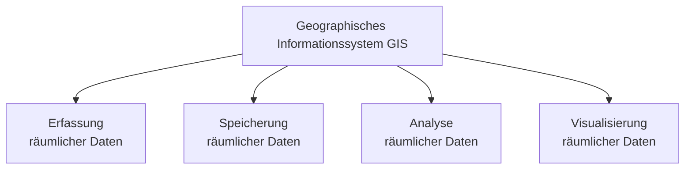
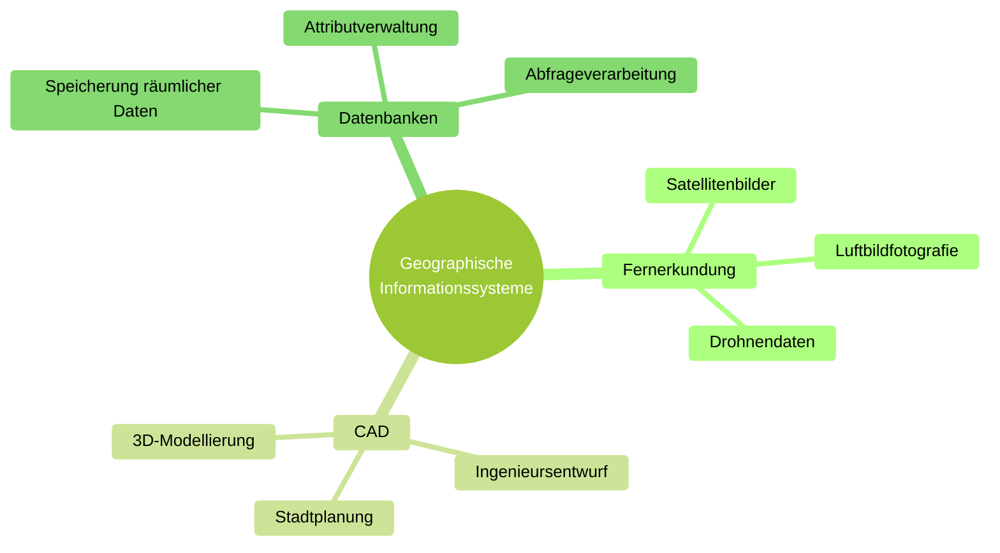

# Was ist GIS?

---

## Definition

Ein **Geographisches Informationssystem (GIS)** ist ein System zur:

Weder Fernerkundung, noch CAD, noch Datenbanken für sich allein sind ein GIS. 
Erst die **Integration aller drei Komponenten** macht ein Geographisches Informationssystem aus.

---

## Räumliche Fragestellungen

GIS beantwortet Fragen wie:

- Wo befindet sich etwas?
- Was liegt in der Nähe?
- Wie verändern sich räumliche Strukturen?
- Welche Flächen sind betroffen?

---

## Typische Anwendungsbereiche

| Bereich | Beispiel |
|----------|----------|
| Verwaltung | Flächennutzung |
| Umwelt | Hochwasseranalyse |
| Stadtplanung | Infrastruktur |
| Verkehr | Netzwerkanalyse |

---

## Bestandteile eines GIS

Ein GIS besteht aus:

- 🗺 Geodaten
- 💻 Software
- 👤 Anwendern
- 🧠 Analytischen Methoden

---

## Reflexionsfrage

Welche räumlichen Fragestellungen gibt es in Ihrem Arbeitsbereich?