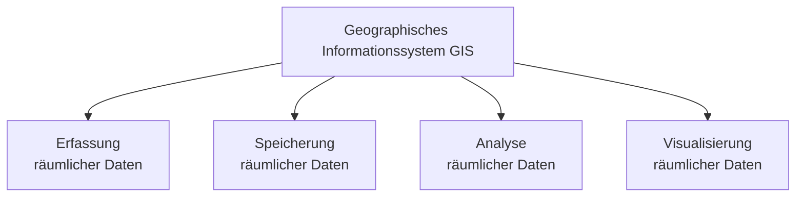
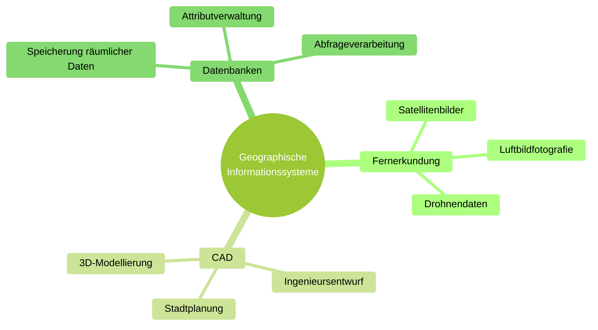
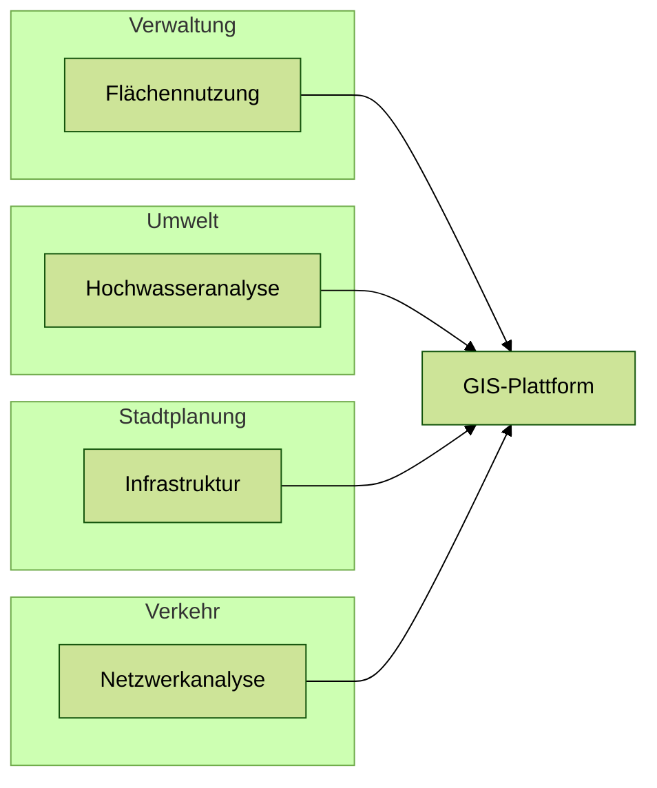

# Was ist GIS?

---

## Definition

Ein **Geographisches Informationssystem (GIS)** ist ein System zur:

Weder Fernerkundung, noch CAD, noch Datenbanken für sich allein sind ein GIS. 
Erst die **Integration aller drei Komponenten** macht ein Geographisches Informationssystem aus.

---

## Räumliche Fragestellungen

GIS beantwortet Fragen wie:

| Frage | Beispiel |
|-------|----------|
| **Wo** befindet sich etwas? | Standort von Schulen, Krankenhäusern |
| **Was** liegt in der Nähe? | Supermärkte im Umkreis von 1 km |
| **Wie** verändern sich Strukturen? | Stadtwachstum über 10 Jahre |
| **Welche** Flächen sind betroffen? | Überschwemmungsgebiete |

---
## Typische Anwendungsbereiche

---

## Bestandteile eines GIS

Ein GIS besteht aus:

- 🗺 Geodaten
- 💻 Software
- 👤 Anwendern
- 🧠 Analytischen Methoden
