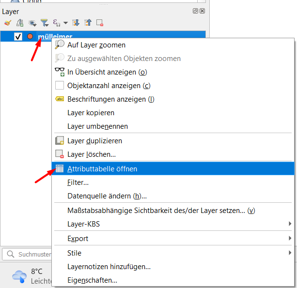
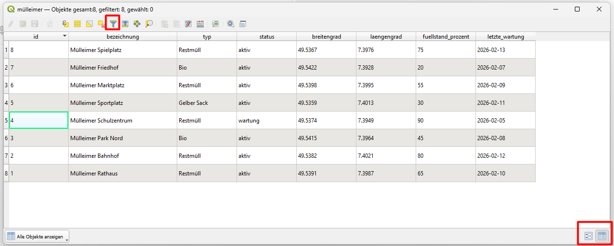
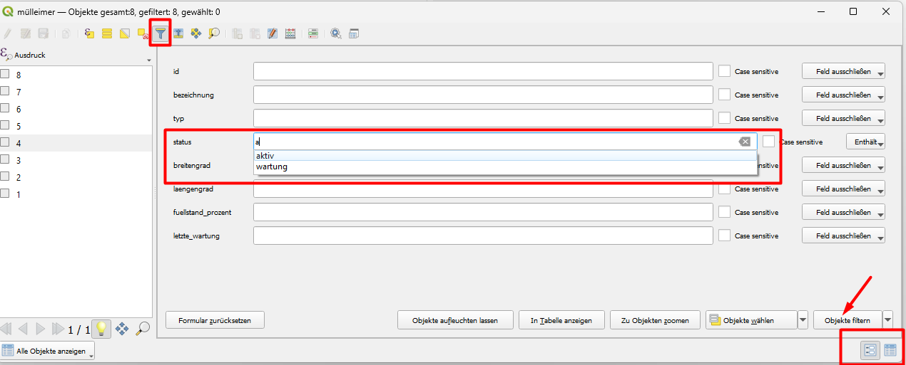
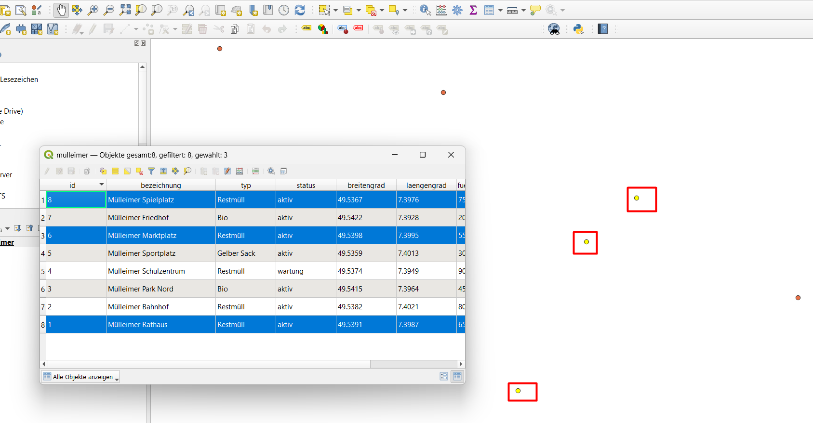

# Block 2 – Attributtabellen (kurze Demo)

## Attributtabelle öffnen

- Rechtsklick auf einen Layer → **Attributtabelle öffnen**

Die Tabelle zeigt alle Sachdaten (Attribute) der Geometrien.

## Sortieren

- Klicken Sie auf eine Spaltenüberschrift, um aufsteigend zu sortieren.
- Nochmal klicken für absteigende Sortierung.

## Filtern

1. Klicken Sie auf das **Filter-Symbol**.
2. Geben Sie einen Ausdruck ein, z.B. `"name" = 'Rathaus'` (Textwerte in einfache Anführungszeichen).
3. OK – die Tabelle zeigt nur noch die gefilterten Zeilen; auf der Karte werden die anderen Objekte ausgegraut.

## Filter zurücksetzen

- Klicken Sie auf das **Filter-Symbol** und löschen Sie den Ausdruck, oder drücken Sie den **Papierkorb**-Button.

## Selektion

- Klicken Sie in der Tabelle auf eine Zeilennummer (links) – das Objekt wird auf der Karte gelb markiert.
- Oder klicken Sie auf der Karte ein Objekt an – die zugehörige Zeile in der Tabelle wird markiert.

