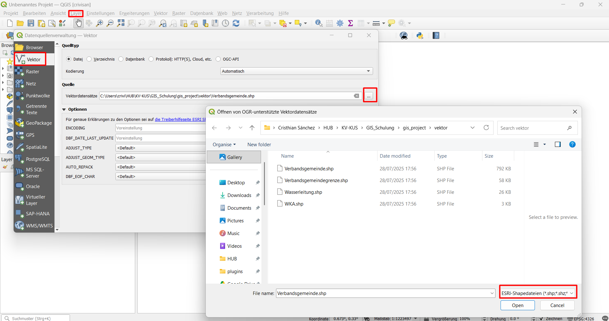
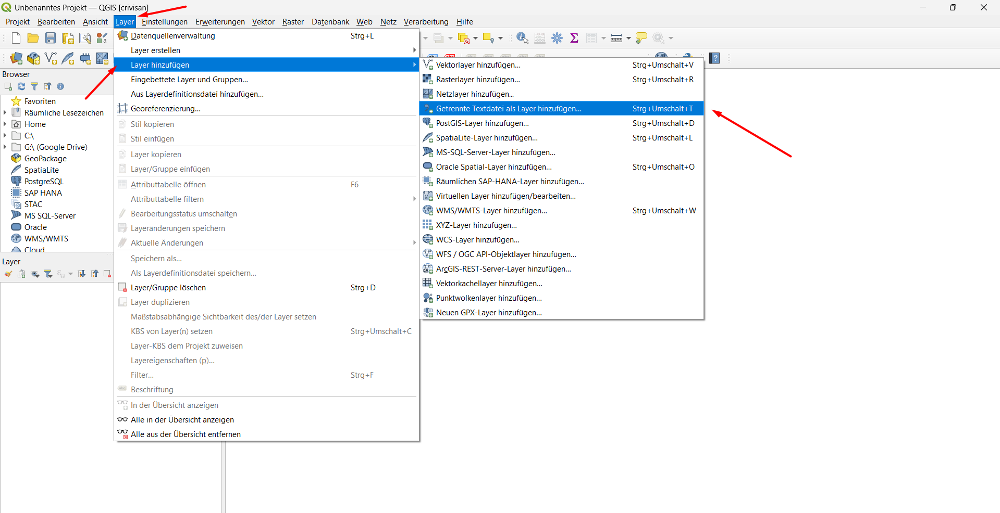
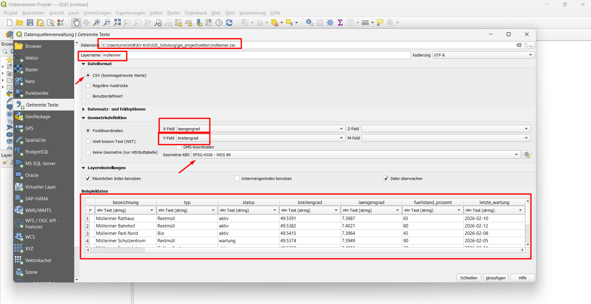
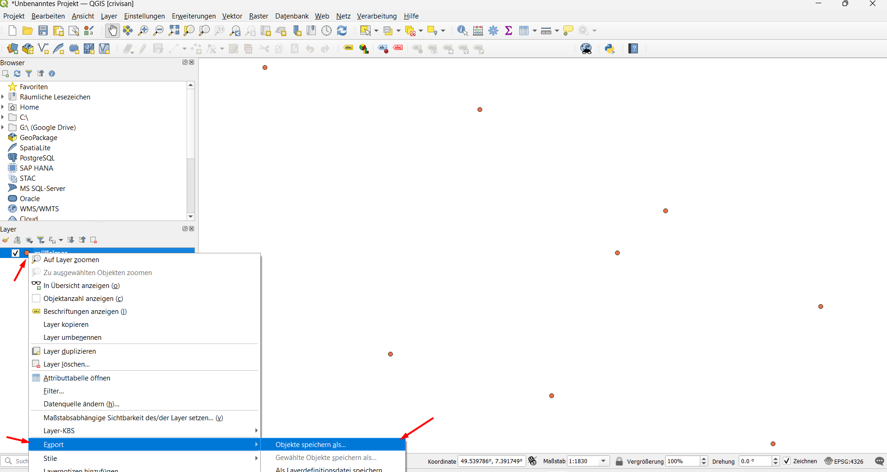
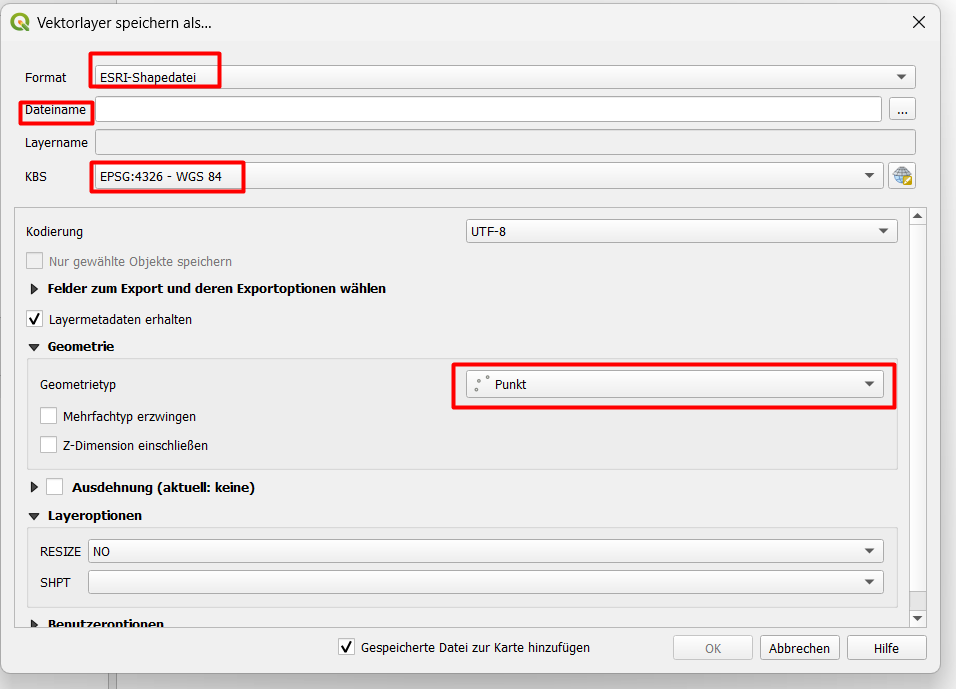
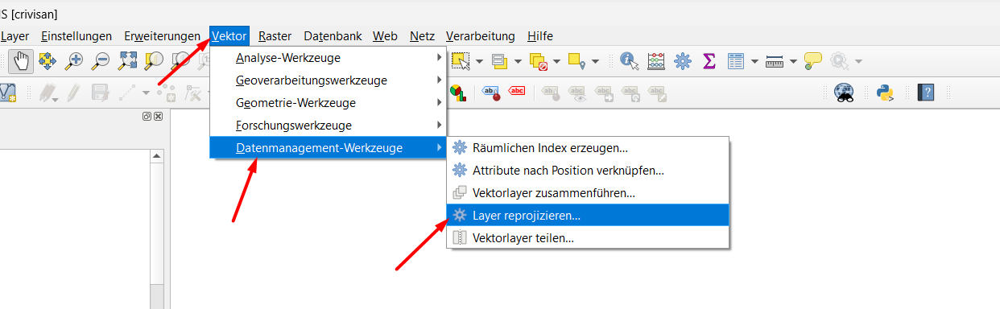
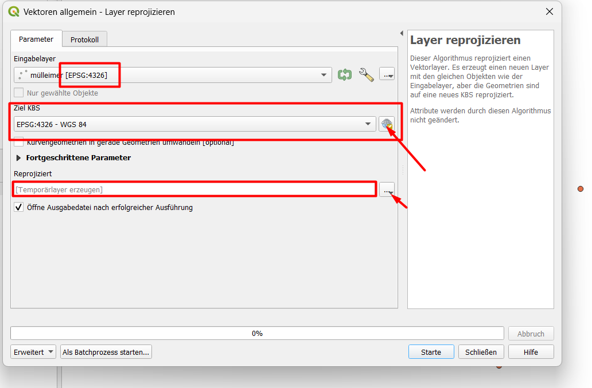

# Block 1 – Lokale Daten laden

## Theorie: Lokale Geodaten-Formate

Geodaten können auf Ihrem Computer gespeichert sein. Die wichtigsten Formate:

| Format | Typ | Beschreibung |
|--------|-----|--------------|
| Shapefile (.shp) | Vektor | Klassisches Format (mehrere Dateien) |
| GeoPackage (.gpkg) | Vektor | Modernes Containerformat (eine Datei) |
| CSV (.csv) | Tabelle | Enthält Koordinaten für Punkte |
| GeoTIFF (.tif) | Raster | Bild mit Georeferenz |

CSV-Dateien enthalten keine Geometrie, aber Koordinaten-Spalten (z.B. `lat` und `lon`). Daraus erstellt QGIS Punkte.

## 1. Shapefile laden

1. **Layer → Datenquelle verwalten** (oder `Strg+L`)
2. **Quelltyp**: `Vektor`
3. **Quelle**: Klicken Sie auf `...` und wählen Sie Ihre `.shp`-Datei
4. **Hinzufügen**

## 2. CSV importieren

Verwenden Sie die Übungsdatei `muellheimer.csv` mit Koordinaten.

### Schritte
1. **Layer → Datenquelle verwalten** → Reiter `Getrennte Textdatei`
2. CSV-Datei auswählen
3. **X-Feld**: `lon`, **Y-Feld**: `lat`
4. **Geometrie-Typ**: `Punkt`
5. **CRS** (Koordinatensystem): `EPSG:4326` (WGS84, weil die Koordinaten in Grad vorliegen)
6. **Hinzufügen**

Die Punkte erscheinen nun im Kartenfenster.

## 3. Exportieren in andere Formate

Nachdem die CSV als Layer geladen ist, können Sie sie in andere Vektorformate exportieren.

### a) Nach Shapefile exportieren
- Rechtsklick auf den Layer → **Export** → **Objekte speichern unter**
- Format: `ESRI Shapefile`
- Dateiname: `meine_punkte.shp`
- **CRS**: Wählen Sie ein projiziertes System, z.B. `EPSG:25832` (UTM Zone 32N)
- OK

### b) Nach GeoPackage exportieren
- Gleicher Weg, aber Format: `GeoPackage`
- Dateiname: `meine_punkte.gpkg`
- Layername: z.B. `punkte`

## 4. Transformation von geographischen zu projizierten Koordinaten

Die ursprünglichen Koordinaten waren in Grad (WGS84). Für metrische Analysen in Deutschland benötigen Sie ein projiziertes System wie **EPSG:25832**.

**Methode 1: Export mit Ziel-CRS** (wie oben)  
Beim Export wird die Geometrie automatisch umgerechnet.

**Methode 2: Layer neu projizieren**
- **Vektor → Datenmanagement-Werkzeuge → Layer neu projizieren**
- Eingabelayer: Ihr CSV-Layer
- Ziel-CRS: `EPSG:25832`
- Ausgabedatei: z.B. `punkte_utm.shp`

## Mini-Übung
1. Importieren Sie die `muellheimer.csv`.
2. Exportieren Sie den Layer als GeoPackage mit CRS `EPSG:25832`.
3. Öffnen Sie die Attributtabelle des exportierten Layers – die Koordinaten sind jetzt in Metern (sichtbar in der Spalte, falls vorhanden).

> **Hinweis**: Die Koordinatenwerte in der Attributtabelle bleiben gleich, aber die Geometrie wurde transformiert. Um die neuen Koordinaten zu sehen, können Sie die Spalten `$x` und `$y` im Attributrechner berechnen.