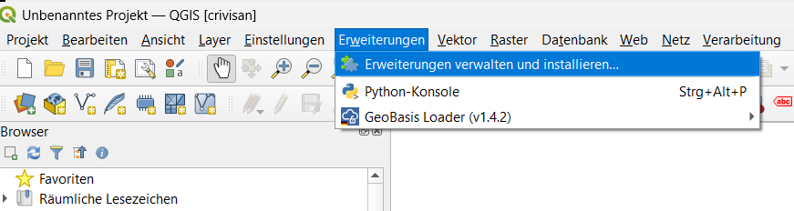
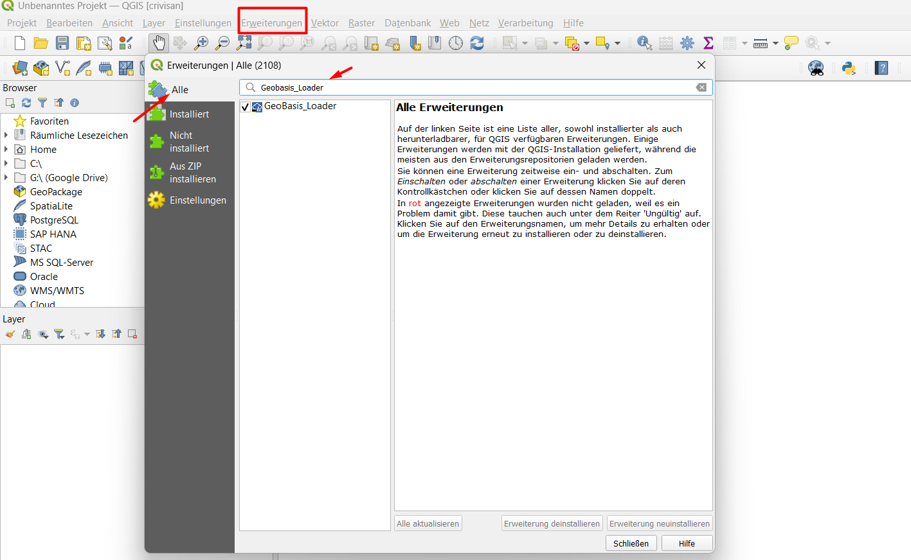
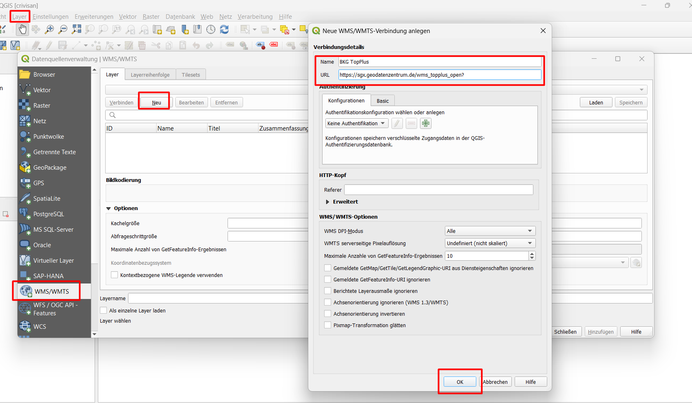
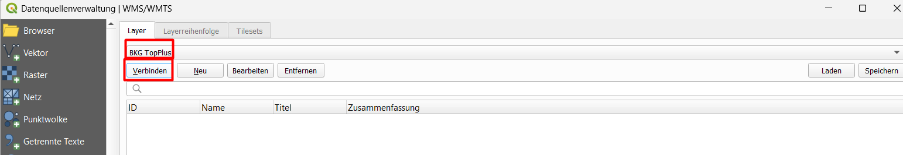
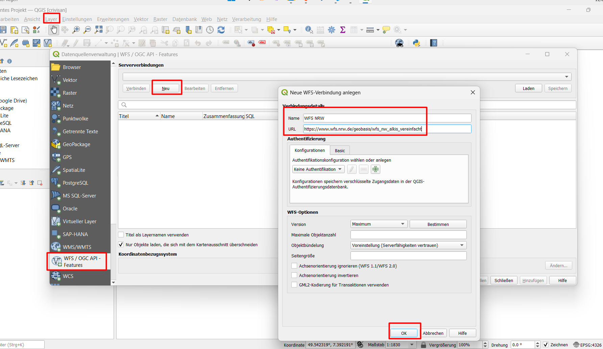
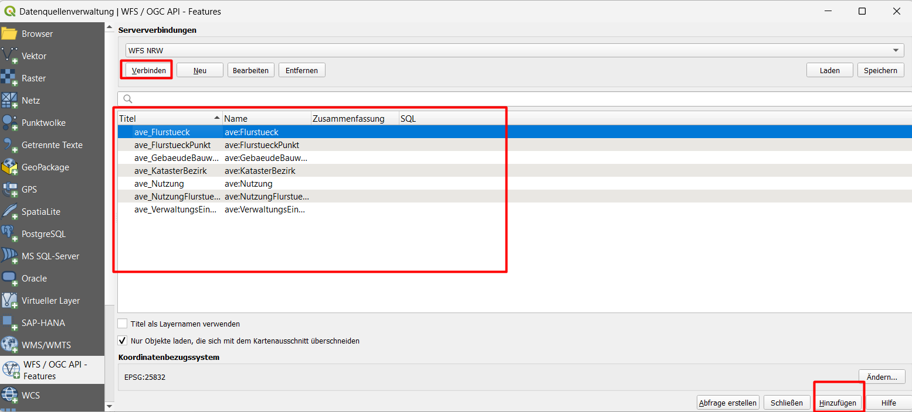

# Block 3 – Webdienste (WMS / WFS)

## Kurzeinführung: Plugins in QGIS

Plugins erweitern QGIS um zusätzliche Funktionen. Sie werden über **Erweiterungen → Erweiterungen verwalten** installiert.

**Besonders nützlich für deutsche Geodaten:**  
🔌 `geobasis_loader` – lädt automatisch WMS- und WFS-Dienste der Bundesländer (Luftbilder, topografische Karten, Verwaltungsgrenzen).

## WMS – Web Map Service

Liefert **Kartenbilder** (Pixel). Ideal als Hintergrundkarte, aber keine Attribute, keine Analyse.

### Beispiel: BKG TopPlus Open
1. **Layer → Datenquelle verwalten → WMS/WMTS**
2. **Neu** – Name: `BKG TopPlus`, URL: `https://sgx.geodatenzentrum.de/wms_topplus_open?`
3. **Verbinden** – Layer auswählen (z.B. `topplus_open`)
4. **Hinzufügen**

## WFS – Web Feature Service

Liefert **echte Vektordaten** mit Attributen. Damit können Sie arbeiten wie mit lokalen Dateien (Filtern, Selektieren, Analysieren).

### Beispiel: WFS NRW (Gemeindegrenzen)
1. **Layer → Datenquelle verwalten → WFS**
2. **Neu** – Name: `WFS NRW`, URL: `https://www.wfs.nrw.de/geobasis/wfs_nw_alkis_vereinfacht`
3. **Verbinden** – Layer wählen, z.B. `ave:gebiet` (Gemeinden)
4. **Hinzufügen**

Öffnen Sie die Attributtabelle (Rechtsklick → Attributtabelle) – Sie sehen die Gemeindenamen, Schlüsselnummern etc.

## Vergleich WMS vs. WFS

| Merkmal | WMS | WFS |
|---------|-----|-----|
| Datentyp | Bild (Raster) | Vektordaten |
| Attribute | Nein | Ja |
| Analyse möglich | Nein | Ja |
| Typische Nutzung | Hintergrundkarten | Arbeitsdaten |

## Mini-Übung
1. Installieren Sie das Plugin `geobasis_loader`.
2. Nutzen Sie es, um einen WMS-Luftbildlayer für Ihr Bundesland zu laden.
3. Laden Sie einen WFS-Layer mit Verwaltungsgrenzen (z.B. Gemeinden).
4. Öffnen Sie die Attributtabelle des WFS-Layers und wählen Sie ein Objekt aus.