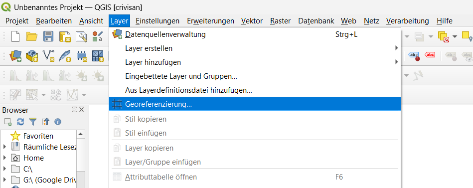
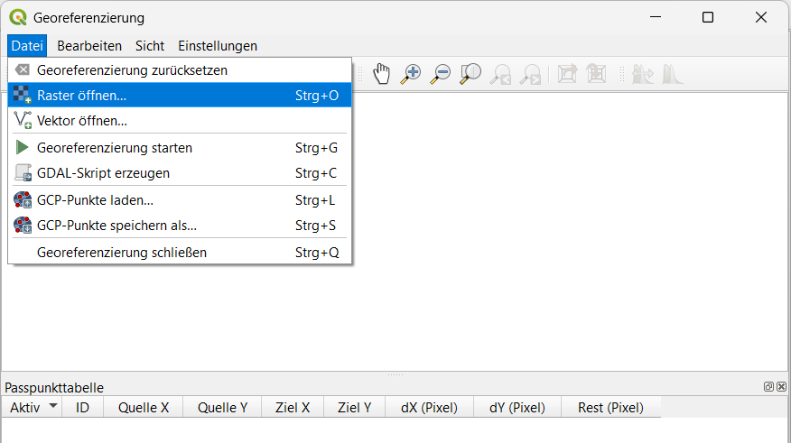
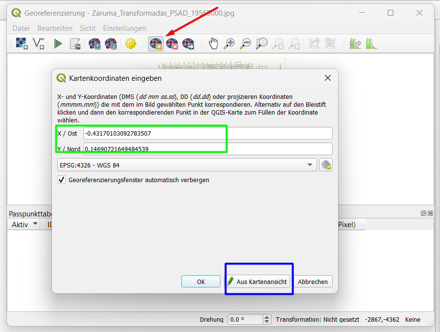
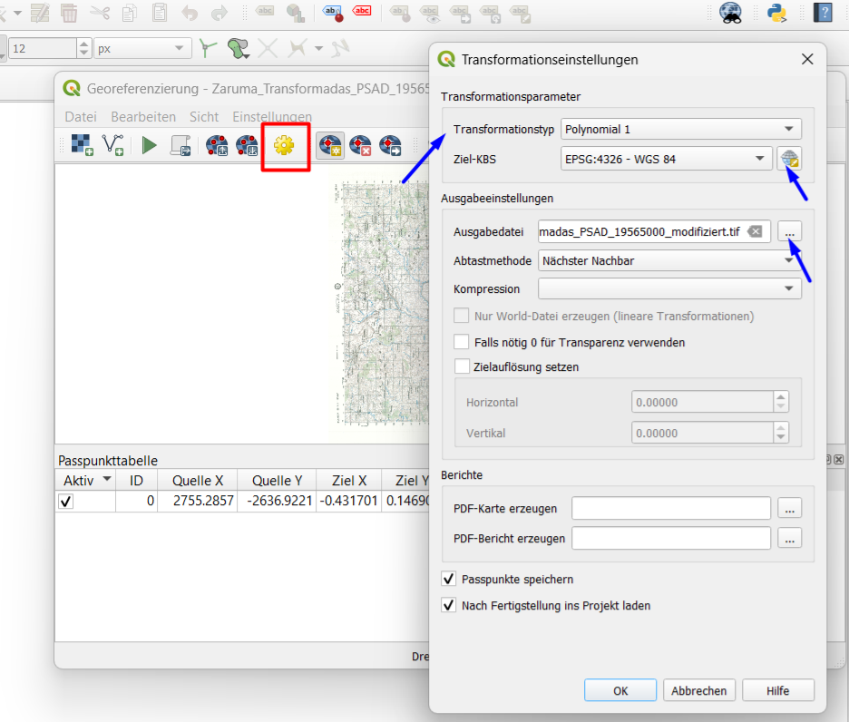

# Georeferencing

## Theorie: Was ist Georeferencing?

Georeferencing bedeutet, einer gescannten Karte oder einem Bild ohne Raumbezug echte Koordinaten zu geben.

| Begriff | Bedeutung |
|---------|-----------|
| GCP | Ground Control Point – bekannter Punkt auf dem Scan und in der Realität |
| Transformation | Mathematische Berechnung, die das Bild verzerrt |
| Resampling | Neuberechnung der Pixelwerte |

## Schritt-für-Schritt

### 1. Georeferencer öffnen
**Layer → Georeferencer**

### 2. Rasterbild laden
Klicken Sie auf **Raster öffnen** und wählen Sie Ihre gescannte Datei (z.B. `.jpg`, `.png`, `.tif`, `.pdf`).

### 3. GCPs setzen

Setzen Sie mindestens 4 Passpunkte.

1. Klicken Sie auf einen markanten Punkt im Scan (z.B. Kreuzung, Kirchturm)
2. Klicken Sie im Kartenfenster auf die gleiche Stelle (OpenStreetMap als Referenz)
3. Die Koordinaten werden automatisch übernommen
4. Wiederholen Sie dies für weitere Punkte

| GCP | Im Scan | Auf der Referenzkarte |
|-----|---------|----------------------|
| 1 | Markante Kreuzung | Gleiche Kreuzung |
| 2 | Gebäudeecke | Gleiche Gebäudeecke |
| 3 | Brücke | Gleiche Brücke |
| 4 | Platz | Gleicher Platz |

### 4. Transformationseinstellungen

Klicken Sie auf **Transformationseinstellungen** (Zahnrad-Symbol)

| Einstellung | Wert |
|-------------|------|
| Transformation | Helmert oder Polynomisch 1 |
| Resampling | Bilinear oder Nächste Nachbarschaft |
| Ziel-CRS | EPSG:25832 (für Deutschland) |
| Ausgabedatei | `georeferenziert.tif` |
| Zielauflösung | Pixelgröße in Metern (z.B. 1) |

### 5. Georeferencing starten

Klicken Sie auf den **grünen Pfeil** (Georeferencing starten).

### 6. Ergebnis prüfen

Laden Sie die Ausgabedatei in QGIS und überprüfen Sie, ob sie korrekt liegt.

## Tipps

- Je mehr GCPs, desto genauer (mindestens 4, besser 6-8)
- Verteilen Sie die Punkte gleichmäßig über das Bild
- Vermeiden Sie Punkte, die alle auf einer Linie liegen
- Kontrollieren Sie den Fehler (RMS) – kleine Werte sind gut