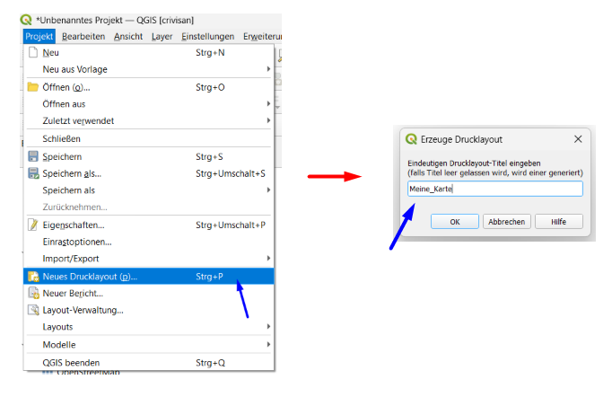
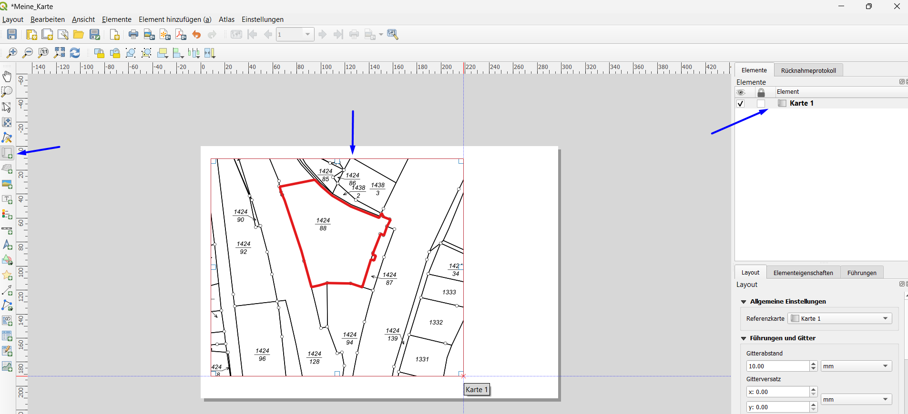
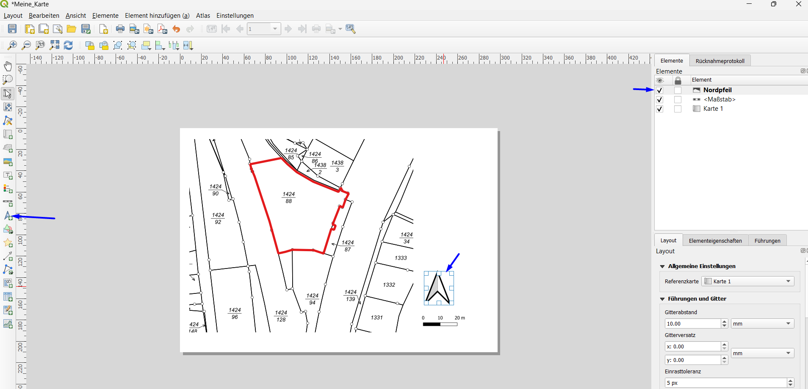
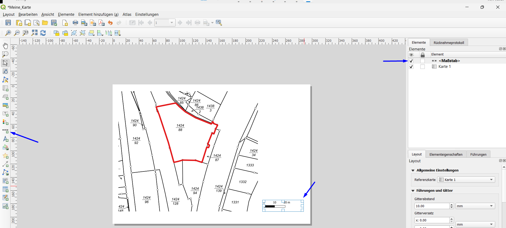
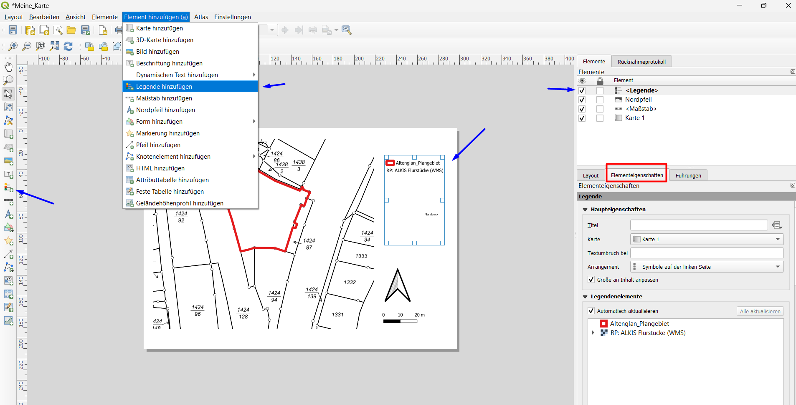

# Print Layout

## Theorie: Was ist ein Drucklayout?

Ein Drucklayout ist die gestaltete Karte für Ausdruck oder Export – mit Rahmen, Legende, Nordpfeil, Maßstab und Titel.

## Schritt-für-Schritt

### 1. Neues Layout erstellen
**Projekt → Neues Drucklayout**

Name vergeben, z.B. `Meine_Karte`

### 2. Karte einfügen

Klicken Sie auf **Karte hinzufügen** (Symbol mit Karte und Mauszeiger).

Ziehen Sie ein Rechteck auf der weißen Fläche auf.

### 3. Nordpfeil einfügen

Im **Eigenschaften-Fenster** →  `Nordpfeil` auswählen oder eigene Datei laden.

### 4. Maßstabsleiste einfügen

Klicken Sie auf **Maßstabsleiste hinzufügen** → Ziehen Sie ein Rechteck auf.

Einstellungen anpassen:
- **Einheiten**: Meter oder Kilometer
- **Segmentgröße**: z.B. 500 oder 1000
- **Beschriftung**: links, rechts, mit Einheit

### 5. Legende einfügen

Klicken Sie auf **Legende hinzufügen** → Ziehen Sie ein Rechteck auf.

Im **Eigenschaften-Fenster** können Sie:
- Layer umbenennen
- Nicht benötigte Layer ausblenden
- Reihenfolge ändern

### 7. Titeltext einfügen

Klicken Sie auf **Text hinzufügen** → Ziehen Sie ein Rechteck auf.

Geben Sie einen Titel ein, z.B. `Historische Karte von Müllheim`

### 8. Exportieren

**Layout → Als Bild/PDF exportieren**

| Format | Verwendung |
|--------|-----------|
| PDF | Druck, Weitergabe |
| PNG | Web, Präsentation |
| SVG | Weiterbearbeitung (z.B. Inkscape) |

