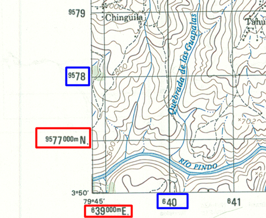
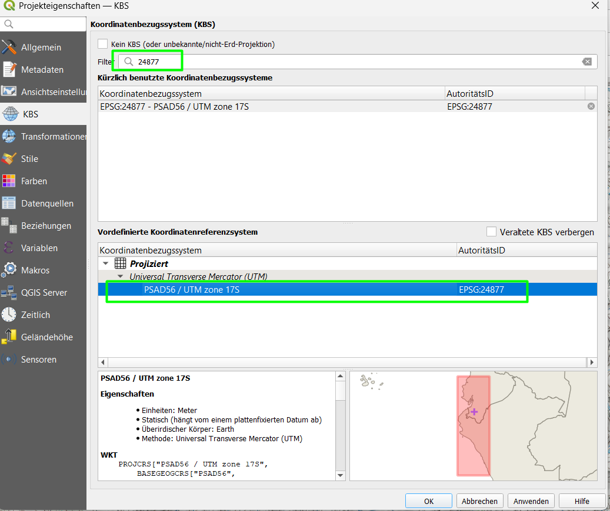
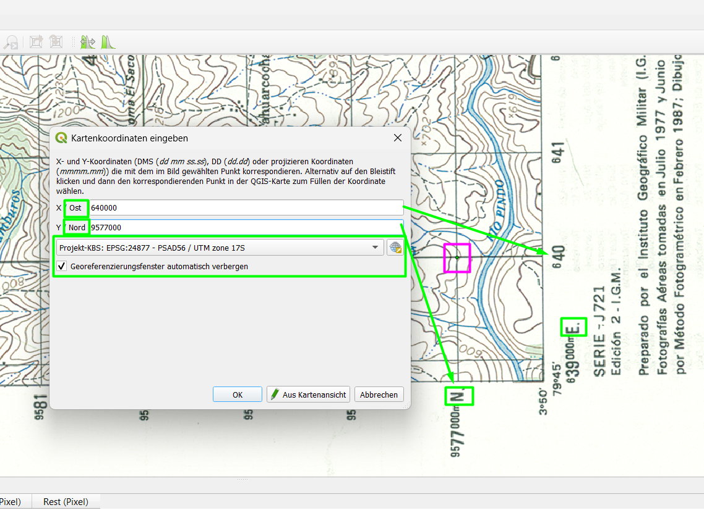
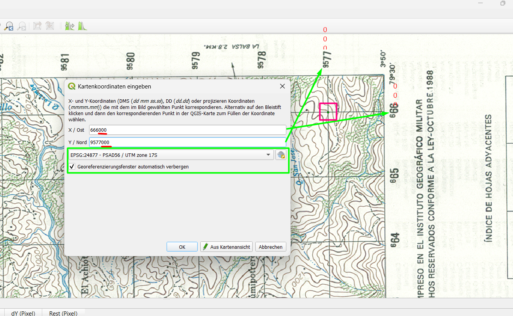
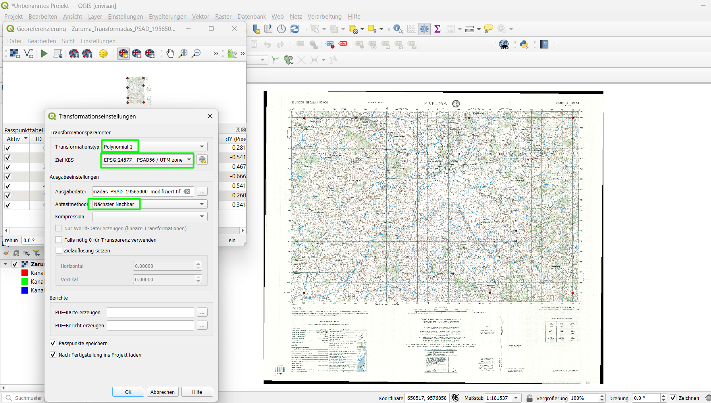
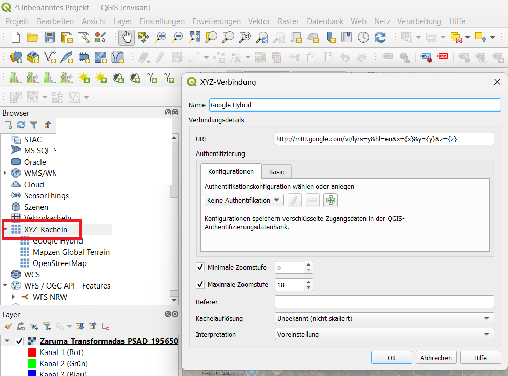
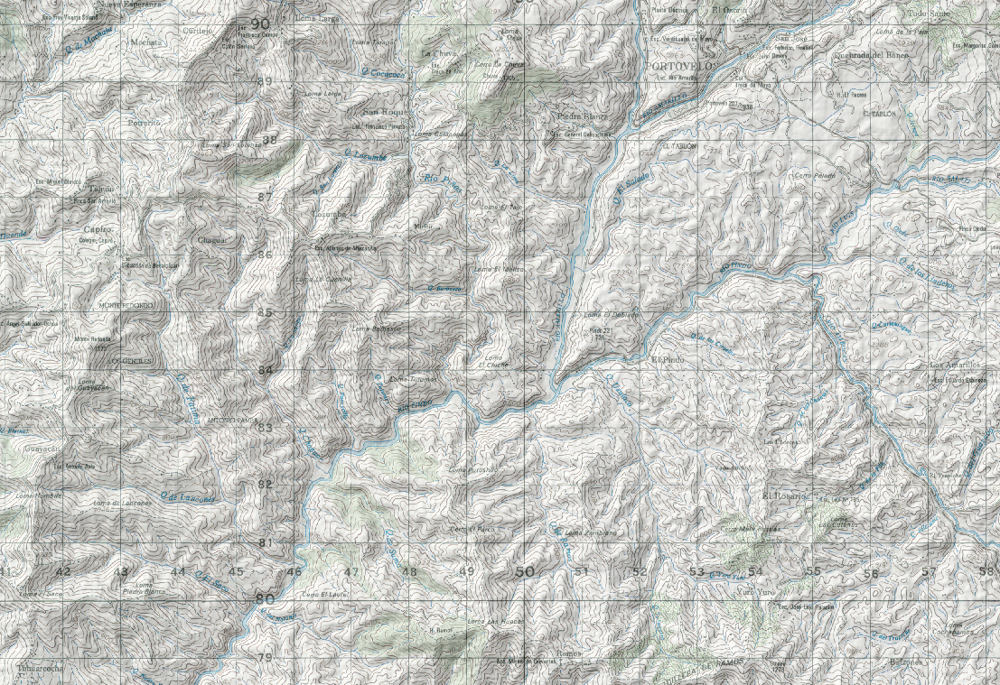

# Georeferencing & Layout

# Georeferenzierung einer gescannten Karte

---

## Ziel der Aufgabe

In dieser Übung georeferenzieren Sie eine gescannte Karte **ohne Hintergrundkarte (WMS)**.

Stattdessen verwenden Sie: **Koordinatengitter + angegebene Koordinaten**

---

## Vorbereitung

- Verwenden Sie **einen zweiten Monitor**
- Öffnen Sie die Bilddatei **zusätzlich außerhalb von QGIS**

---

## Wichtiger Hinweis zur Karte

Am **unteren linken Rand** der Karte finden Sie die vollständigen Koordinaten:

Beispiel:

- **9577000 m N**
- **639000 m E**

❗❗❗ Besonderheit des Gitters❗❗❗

Die restlichen Koordinaten im Raster sind **gekürzt dargestellt**:

- Beispiel: `640` bedeutet → **640000 m E**
- Beispiel: `9578` bedeutet → **9578000 m N**

Sie müssen also **„000“ ergänzen**

**Warum?**  
Zur besseren Lesbarkeit und um die Karte nicht zu überladen.

---

## Schritt 1 – QGIS Projekt vorbereiten

1. QGIS öffnen
2. Neues Projekt erstellen

### CRS einstellen

1. Menü **Projekt → Eigenschaften**
2. Reiter **KBS**
3. Suche: `24877`

Wählen Sie:

**PSAD56 / UTM Zone 17S**

---

## Schritt 2 – Georeferenzierer öffnen

1. Menü **Layer → Georeferenzierung**

---

## Schritt 3 – Bild laden

1. **Datei → Raster öffnen**
2. Ihre Karte auswählen (`Zaruma_Transformadas_PSAD_19565000.jpg`)

---

## Hinweis zur Darstellung

Das Bild wird zunächst:

- gedreht / verschoben erscheinen

Deshalb: Bild **parallel außerhalb von QGIS geöffnet lassen**

---

## Schritt 4 – GCP Punkte setzen

Jetzt beginnt der wichtigste Teil.

Wir verwenden: **Gitterkreuzungen + Koordinaten**

---

### Vorgehen

1. Klicken Sie auf eine Gitterkreuzung
2. Geben Sie die Koordinaten manuell ein

---

### Beispiel

Punkt:

- X (Easting): `640000`
- Y (Northing): `9577000`

❗❗❗ Wichtige Hinweise ❗❗❗

- X = **Easting (Ost)** → kleinere Werte (~600000)
- Y = **Northing (Nord)** → größere Werte (~9.5 Mio)

Merksatz: **X = tausend / Y = million**

---

## Aufgabe

- Setzen Sie mindestens **6–8 GCP Punkte**
- Verteilen Sie die Punkte über die gesamte Karte

---

## Schritt 5 – Transformation einstellen

1. Klicken Sie auf das **Zahnrad-Symbol**

---

### Einstellungen

- Transformation: **Polynomial 1**
- Ziel-KBS: **PSAD56 / UTM Zone 17S (EPSG:24877)**
- Ausgabe: `.tif` Datei auswählen

Rest kann unverändert bleiben.

---

## Schritt 6 – Georeferenzierung starten

1. Klicken Sie auf das **Play-Symbol**

---

## Ergebnis

- Das Bild erscheint korrekt ausgerichtet im Projekt
- Die Karte ist nun georeferenziert

---

# Zusatz – Hintergrundkarte hinzufügen

## Google Hybrid

1. Browser → XYZ-Kacheln → Rechtsklick → Neue Verbindung

Name:

Google Hybrid

URL:

http://mt0.google.com/vt/lyrs=y&hl=en&x={x}&y={y}&z={z}

---

## Layer hinzufügen

- XYZ-Kacheln → **Google Hybrid** Rechtsklick → **Zum Projekt hinzufügen**
- Unter den Georeferenz-Layer legen

---

# Extra – 3D-Effekt (Topographie)

## Transparenz einstellen

1. Rechtsklick auf Georeferenz-Layer
2. Eigenschaften → Transparenz
3. ~60 %

---

## Mapzen Terrain

1. XYZ-Kacheln → **Mapzen Global Terrain** Rechtsklick → **Zum Projekt hinzufügen**
2. Unter den Georeferenz-Layer legen

---

## Schummerung aktivieren

1. **Mapzen Global Terrain** Rechtsklick → Eigenschaften
2. Symbolisierung
3. Darstellungsart: **Schummerung**

---

## Aufgabe

- Prüfen Sie:
  - Stimmen Flüsse überein?
  - Stimmen Höhenlinien grob?

---

## Ergebnis

- Höhenmodell sichtbar
- Flüsse & Höhenlinien passen zusammen

Sie haben jetzt eine **2D-Karte mit 3D-Wirkung kombiniert**

---

# Reflexion

- Wie genau ist Ihre Georeferenzierung?
- Welche Punkte waren schwierig?
- Warum ist die Verteilung der GCPs wichtig?
