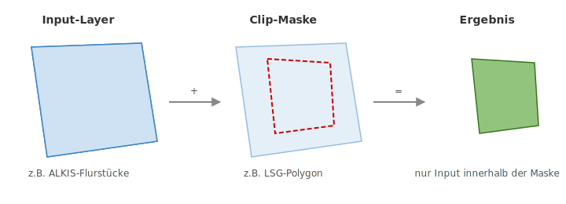
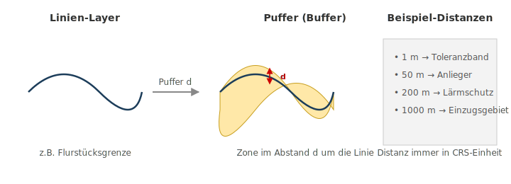
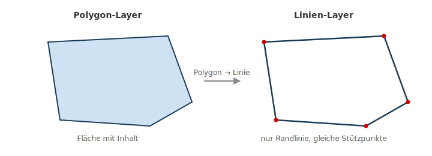
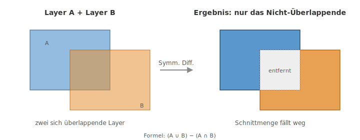
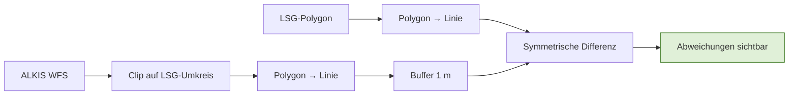

# Analyse-Grundlagen

## Worum geht es?

Geoverarbeitung (engl. *Geoprocessing*) bedeutet: aus bestehenden Geodaten neue Geodaten berechnen. Das Ergebnis ist immer ein **neuer Layer** – die Eingangsdaten bleiben unverändert.

In dieser Sitzung lernen Sie vier zentrale Werkzeuge kennen. Jedes davon hat genau eine Aufgabe, und richtig kombiniert lösen sie auch komplexe Fragestellungen.

| Werkzeug | Antwortet auf die Frage |
|----------|--------------------------|
| **Clip** (Zuschneiden) | „Welcher Teil von A liegt innerhalb von B?" |
| **Buffer** (Puffer) | „Welche Zone liegt im Abstand *d* um meine Geometrie?" |
| **Polygon → Linie** | „Wie sehen nur die *Ränder* meiner Flächen aus?" |
| **Symmetrische Differenz** | „Wo unterscheiden sich A und B voneinander?" |

---

## 1. Clip – Zuschneiden

**Was passiert?** Ein Layer wird auf die Form eines anderen Layers reduziert. Alles außerhalb wird entfernt.

| Eingabe | Bedeutung |
|---------|-----------|
| **Input-Layer** | der Layer, der zugeschnitten wird (z.B. ALKIS-Flurstücke) |
| **Clip-Layer** | die "Schablone", auf die zugeschnitten wird (z.B. LSG-Polygon) |
| **Ergebnis** | nur die Teile des Input-Layers, die innerhalb der Schablone liegen |

!!! info "Typische Anwendung"
    Sie haben einen großen Datensatz (z.B. ALKIS für den ganzen Landkreis) und brauchen nur den Ausschnitt für ein Projektgebiet. Clip macht aus 30.000 Flurstücken vielleicht 80 – das spart Rechenzeit und Übersicht.

**In QGIS finden Sie das Werkzeug unter:**
**Vektor → Geoverarbeitungswerkzeuge → Zuschneiden**

---

## 2. Buffer – Puffer

**Was passiert?** Um jede Geometrie wird eine Zone in einem festgelegten Abstand *d* gelegt. Das Ergebnis ist immer ein **Polygon**.

| Eingabe | Bedeutung |
|---------|-----------|
| **Input-Layer** | Punkte, Linien oder Polygone |
| **Abstand** | in der Einheit des Koordinatensystems (bei EPSG:25832 in Metern) |
| **Auflösung** | Anzahl Stützpunkte pro Viertelkreis (Standard 5 reicht) |
| **Auflösen** | ob sich überlappende Puffer zu einem Polygon verschmolzen werden |

!!! warning "Achtung: Einheit prüfen"
    In einem geografischen Koordinatensystem (EPSG:4326) sind die Einheiten **Grad**, nicht Meter. Ein Puffer mit "50" wäre dann 50 Grad ≈ 5500 km. **Immer vorher auf EPSG:25832 (oder ein anderes metrisches CRS) projizieren.**

**Typische Distanzen aus der Verwaltungspraxis:**

- **1 m** – Toleranzband, um Digitalisierungsungenauigkeiten auszublenden
- **50 m** – Anliegerbenachrichtigung bei Baumaßnahmen
- **200 m** – Lärmschutzbereich
- **1000 m** – Einzugsbereich z.B. für Standortanalysen

**In QGIS:** **Vektor → Geoverarbeitungswerkzeuge → Puffer**

---

## 3. Polygon → Linie

**Was passiert?** Aus einem Flächen-Layer wird ein Linien-Layer – nur die Ränder bleiben übrig.

**Warum macht man das?**

- Linien lassen sich anders puffern als Flächen (z.B. nur „um die Grenze herum", nicht „in die Fläche hinein")
- Linien-Layer brauchen für Analysen weniger Rechenleistung
- Sym. Differenz und andere Vergleiche zwischen "nur Rändern" sind oft sinnvoller als zwischen ganzen Flächen

**In QGIS:** **Vektor → Geometrie-Werkzeuge → Polygone zu Linien**

!!! tip "Praxis-Hinweis"
    Bei Multipolygonen (z.B. einem Schutzgebiet aus mehreren Teilflächen) entstehen automatisch mehrere Linien-Features. Die Topologie (also welche Linie zu welcher Fläche gehörte) wird über die **Attribute** mitgegeben.

---

## 4. Symmetrische Differenz

**Was passiert?** Aus zwei Layern A und B werden **nur die Teile** zurückgegeben, die in **genau einem** der beiden Layer vorkommen – die Überlappung fällt weg.

**Mengentheoretische Definition:** Symm. Differenz = (A ∪ B) − (A ∩ B)

| Vergleich | Was passiert |
|-----------|--------------|
| **Schnitt (Intersect)** | nur das Gemeinsame |
| **Vereinigung (Union)** | alles aus A und B |
| **Differenz (Difference)** | nur A, ohne das, was in B liegt |
| **Symmetrische Differenz** | nur das, was *unterschiedlich* ist |

!!! info "Wann ist das nützlich?"
    Wenn Sie zwei Versionen desselben Layers vergleichen wollen – z.B. „alte Schutzgebietsgrenze" gegen „neue Schutzgebietsgrenze" – zeigt die symm. Differenz **genau die Änderungen**. Alles, was gleich geblieben ist, verschwindet.

**In QGIS:** **Vektor → Geoverarbeitungswerkzeuge → Symmetrische Differenz**

---

## Kombination: die Stärke liegt in der Kette

Einzelne Werkzeuge sind selten die Lösung – die echte Stärke entsteht durch **Verkettung**. Ein Beispiel, das wir im nächsten Block durchgehen:

Jeder Schritt für sich ist trivial. Zusammen beantworten sie die Frage: **„An welchen Stellen weicht die LSG-Grenze von den Flurstücksgrenzen ab?"**

Genau das schauen wir uns als nächstes praktisch an: [LSG vs. ALKIS – Praxis](lsg-alkis-vergleich.md).

---

