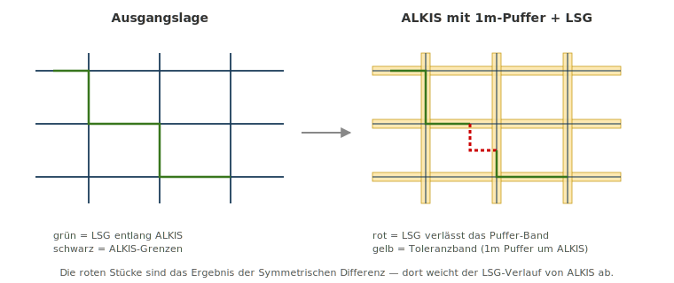
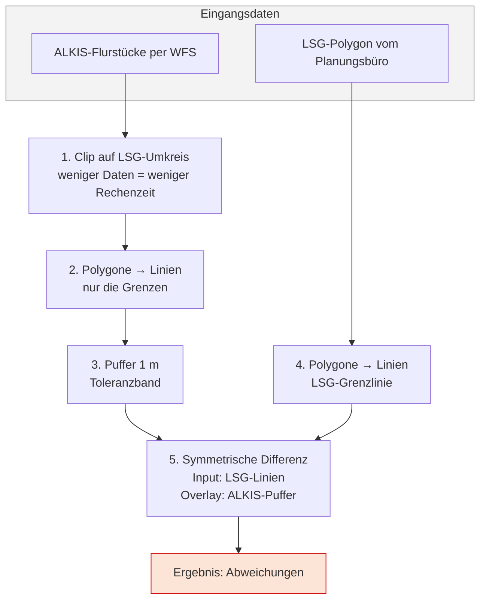

# Praxis: LSG-Grenze gegen ALKIS prüfen

## Der reale Anlass

Ein Landschaftsschutzgebiet (LSG) im Landkreis Kusel wurde durch eine Änderungsverordnung neu festgesetzt. Die geänderten Grenzen wurden von einem externen Planungsbüro als Shape-Datei geliefert und sollten in das landesweite Schutzgebietssystem **LANIS** beim Landesamt für Umwelt Rheinland-Pfalz eingepflegt werden.

Rückmeldung des LfU sinngemäß:

!!! quote "Auszug aus dem fachlichen Schriftverkehr"
    *„Die Daten der anderen LSGs Ihres Landkreises sind nicht wirklich brauchbar digitalisiert. Bitte verwenden Sie zukünftig **ALK-konforme** Geometrien – die LSG-Grenze muss exakt auf den Flurstücksgrenzen aufsetzen."*

**Unsere Aufgabe:** Prüfen, **wo** die gelieferte Geometrie von ALKIS abweicht – damit diese Stellen gezielt korrigiert werden können.

## Die Idee in einem Bild

Wir legen ein **schmales Toleranzband (1 m)** um die ALKIS-Flurstücksgrenzen. Solange die LSG-Linie innerhalb dieses Bandes verläuft, ist sie „nah genug an ALKIS". Verlässt sie das Band, haben wir eine **Abweichung** – und genau die suchen wir.

## Die Analyse-Kette im Überblick

## Schritt-für-Schritt

### 0. Projekt vorbereiten

1. Neues QGIS-Projekt
2. CRS auf **EPSG:25832** (ETRS89 / UTM Zone 32N) einstellen – für Rheinland-Pfalz Standard
3. OpenStreetMap als Hintergrund hinzufügen (XYZ-Tile)

### 1. LSG-Polygon laden

Die vom Planungsbüro gelieferte Datei (`.geojson`, `.shp` oder `.gpkg`) per Drag & Drop in QGIS ziehen oder über **Layer → Layer hinzufügen → Vektor-Layer**.

Symbolisierung:

- Füllung: transparent / hellgrün
- Rand: kräftig grün, 0.6 mm

So sehen Sie sofort, *wo* das Gebiet überhaupt liegt.

### 2. ALKIS per WFS laden (Geobasis Loader)

1. Plugin **Geobasis Loader RLP** installieren (Erweiterungen → Verwalten und installieren)
2. In der Plugin-Leiste auf das Symbol klicken
3. Auswahl: **ALKIS → Flurstücke**
4. Zur LSG-Fläche zoomen, dann **In aktuellen Kartenausschnitt laden**

!!! warning "ALKIS ist groß"
    Wenn Sie versehentlich für den ganzen Landkreis laden, wartet QGIS minutenlang. Immer vorher auf den Bereich des LSG zoomen.

### 3. ALKIS auf den Untersuchungsbereich zuschneiden (Clip)

**Vektor → Geoverarbeitungswerkzeuge → Zuschneiden**

| Feld | Wert |
|------|------|
| Eingabelayer | `alkis_flurstuecke` |
| Überlagerungslayer | `lsg_polygon` |
| Geclippt | `alkis_clip` (neue Datei) |

**Ergebnis:** Nur die ALKIS-Flurstücke, die das LSG schneiden, bleiben übrig – meist sind das nur einige hundert statt zehntausende.

### 4. ALKIS-Polygone zu Linien umwandeln

**Vektor → Geometrie-Werkzeuge → Polygone zu Linien**

| Feld | Wert |
|------|------|
| Eingabelayer | `alkis_clip` |
| Linien | `alkis_lines` |

Jetzt haben wir die Flurstücksgrenzen als Linien-Layer.

### 5. Puffer um die ALKIS-Linien legen (1 m)

**Vektor → Geoverarbeitungswerkzeuge → Puffer**

| Feld | Wert |
|------|------|
| Eingabelayer | `alkis_lines` |
| Abstand | `1` (Einheit Meter – wegen EPSG:25832) |
| Segmente | 5 |
| Endkappenstil | Rund |
| Verbindungsstil | Rund |
| Ergebnis auflösen | ja |
| Gepuffert | `alkis_buffer` |

**Visuell:** Sie sehen jetzt ein "Skelett" – ein 2 m breites Band entlang jeder Flurstücksgrenze.

!!! tip "Warum 1 m und nicht 0?"
    Beim Übertragen historischer Karten, Vermessungen oder Plänen entstehen immer kleine Ungenauigkeiten. 1 m ist die Toleranz, die das LfU in der Praxis akzeptiert. Würden Sie 0 m wählen, würde **jede** Mini-Abweichung als Fehler markiert – inklusive irrelevanter Rundungsfehler.

### 6. LSG-Polygon zu Linien umwandeln

Gleiches Werkzeug wie Schritt 4, aber für den LSG-Layer:

| Feld | Wert |
|------|------|
| Eingabelayer | `lsg_polygon` |
| Linien | `lsg_lines` |

### 7. Symmetrische Differenz – das Herzstück

**Vektor → Geoverarbeitungswerkzeuge → Symmetrische Differenz**

| Feld | Wert |
|------|------|
| Eingabelayer | `lsg_lines` |
| Überlagerungslayer | `alkis_buffer` |
| Symm. Differenz | `lsg_abweichungen` |

**Was passiert dabei?**

- Alle LSG-Linienstücke, die **innerhalb** des Puffer-Bandes liegen, gelten als "auf ALKIS aufgesetzt" → fallen weg
- Alle LSG-Linienstücke, die **außerhalb** des Bandes liegen, bleiben übrig → das sind die Abweichungen

### 8. Ergebnis interpretieren

1. Den Layer `lsg_abweichungen` rot und kräftig (1.0 mm) symbolisieren
2. Hineinzoomen und prüfen
3. Mit dem Kartenfenster **OpenStreetMap-Hintergrund** sichtbar lassen

**Was Sie sehen werden:**

- **Lange rote Linien** → Die LSG-Grenze verläuft über mehrere Flurstücke hinweg falsch (echter Fehler, muss korrigiert werden)
- **Kurze rote Stücke an Ecken** → meistens Digitalisier-Artefakte (zu großzügiger Puffer macht das robuster)
- **Keine roten Linien** → die LSG-Grenze ist ALK-konform

## Zusammenfassende Bewertung der Methode

| Stärke | Grenze |
|--------|--------|
| Funktioniert für **jedes** Schutzgebiet, ohne den Datensatz öffnen zu müssen | Findet keine *fehlenden* Flurstücke – nur falsch verlaufende Grenzen |
| Reproduzierbar als Modell im **Modellbauer** speichern | Bei sehr alten Karten kann 1 m Puffer zu eng sein |
| Liefert exakte Geometrie der Fehlstellen | Sym. Differenz auf gemischten Geometrietypen – immer das Ergebnis prüfen |

---

Bereit für die selbstständige Anwendung? → [Übung: LSG Holzbachtal](self-learning.md)
